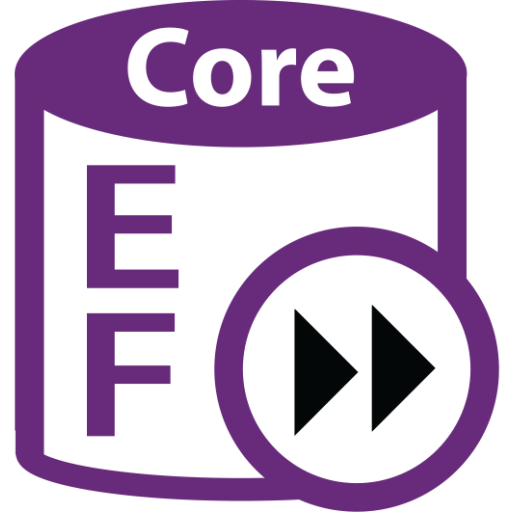

<h1 align="center">
    <b>Hi there, I'm Milo </b>
     
    
</h1>
 

    

 

<h3 align="center">Languages and Tools:</h3>

 
    
    
    
    
    
    
    
    
    
    
    

 
 

"Don’t stop when you are tired. Stop when you are done"

 
 

 

<!--  -->

